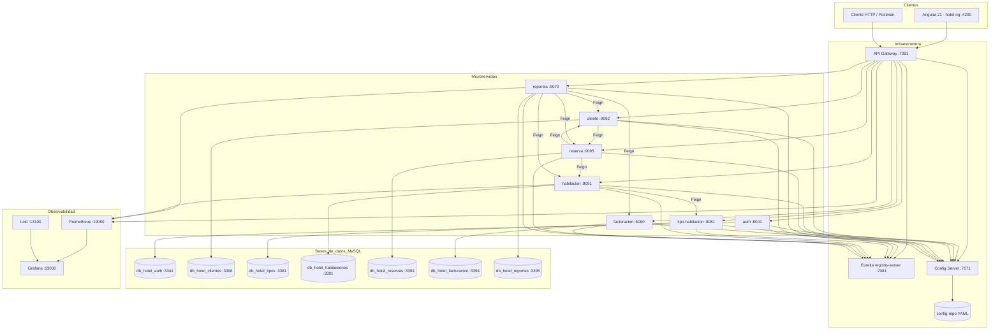

# Plantilla de Informe — Proyecto Final de Microservicios

**Plantilla oficial:** https://261dist.github.io/ecom/informe-template/

| Campo | Valor |
|-------|-------|
| **Universidad** | *[Completar: ej. Universidad Peruana Unión]* |
| **Curso** | *[Completar: ej. Arquitectura de Software Distribuido]* |
| **Docente** | Angel Sullon |
| **Equipo** | *[Completar nombres de integrantes]* |
| **Proyecto** | **Hotel Inti Suites** — Sistema de gestión hotelera con microservicios |
| **Fecha** | Junio 2026 |

---

## 1. Descripción del Proyecto

**Hotel Inti Suites** es un sistema de gestión hotelera orientado a la operación diaria de un establecimiento de hospedaje: registro de huéspedes, catálogo de tipos de habitación, inventario de habitaciones físicas, reservas con ciclo check-in/check-out, facturación de pagos y reportes ejecutivos para la toma de decisiones.

**¿Qué problema resuelve?** Centraliza en una arquitectura de microservicios procesos que tradicionalmente se dispersan en planillas o sistemas monolíticos difíciles de escalar. Permite consultar disponibilidad en tiempo real, sincronizar el estado de cada habitación con el ciclo de la reserva (ocupada, limpieza, mantenimiento) y consolidar indicadores de ocupación e ingresos sin acoplar todas las áreas en un solo despliegue.

**Flujo principal del negocio:**

1. El personal de **recepción** o **administración** inicia sesión en la aplicación Angular y obtiene un JWT vía el servicio **auth**.
2. Se registran **huéspedes** (microservicio **cliente**).
3. Se definen **tipos de habitación** (capacidad, precio base) y las **habitaciones** físicas con tarifa y estado hotelero.
4. Se crea una **reserva** asociando huésped, habitación y fechas; el servicio **reserva** valida al huésped y la habitación mediante **OpenFeign**.
5. Al cambiar el estado de la reserva (**CONFIRMADA**, **CHECK_IN**, **CHECK_OUT**, **CANCELADA**), se actualiza automáticamente el estado de la habitación (por ejemplo CHECK_IN → OCUPADA, CHECK_OUT → LIMPIEZA).
6. Se registra el **pago** en **facturacion** vinculado a la reserva.
7. **reportes** agrega datos de todos los dominios (Feign) y expone dashboards para la UI y para **Grafana** (métricas `hotel.*`).

**Actores / usuarios:**

| Actor | Rol en el sistema | Capacidades principales |
|-------|-------------------|-------------------------|
| **Administrador** | `ADMIN` | CRUD completo: tipos, habitaciones, huéspedes, reservas, facturación |
| **Recepción** | `RECEPCION` | Huéspedes, reservas, consultas; restricciones en catálogo según política de seguridad |
| **Sistema (interno)** | Sin usuario final | Comunicación Feign entre microservicios vía Eureka |

Toda la interacción del usuario final pasa por el **API Gateway** (puerto 7091); el frontend **no** llama a microservicios directamente.

---

## 2. Arquitectura

### 2.1 Diagrama de Arquitectura



**Nota:** No se implementó **Kafka** (tema opcional del curso DIST09). La integración entre dominios es **síncrona** mediante Feign y REST.

### 2.2 Tecnologías

| Componente | Tecnología | Versión |
|------------|------------|---------|
| Lenguaje / Runtime | Java | 17 |
| Framework | Spring Boot | 3.5.x (ej. 3.5.12–3.5.14) |
| Cloud | Spring Cloud | 2025.0.2 |
| Gateway | Spring Cloud Gateway | (incluido en Spring Cloud) |
| Config Server | Spring Cloud Config (native) | — |
| Registry | Netflix Eureka | — |
| Persistencia | Spring Data JPA + MySQL | MySQL 8.4 |
| API docs | SpringDoc OpenAPI | 3.x |
| Seguridad | Spring Security + OAuth2 Resource Server (JWT) | — |
| Resiliencia | Resilience4j (Circuit Breaker) | — |
| Comunicación MS | OpenFeign + LoadBalancer | — |
| Mensajería | — | *No aplica (Kafka no implementado)* |
| Frontend | Angular | 21 (standalone, signals) |
| Contenedores | Docker + Docker Compose | MySQL por servicio (dev/prod) |
| Observabilidad | Prometheus, Loki, Promtail, Grafana | — |

### 2.3 Puertos y Naming

| Servicio | Nombre interno (Eureka) | Puerto app (dev) | Puerto MySQL (host dev) | Puerto app (prod ref.) |
|----------|-------------------------|------------------|-------------------------|-------------------------|
| Config Server | `config-server` | 7071 | — | 7071 |
| Eureka | `registry-server` | 7081 | — | 7081 |
| Gateway | `gateway` | 7091 | — | 7091 |
| Auth | `auth` | 8041 | 3341 | 8042 |
| Cliente (huéspedes) | `cliente` | 9092 | 3396 | 9092 |
| Tipo habitación | `tipo-habitacion` | 8081 | 3381 | 8081 |
| Habitación | `habitacion` | 9091 | 3391 | 9091 |
| Reserva | `reserva` | 9095 | 3393 | 9095 |
| Facturación | `facturacion` | 6060 | 3394 | 6060 |
| Reportes | `reportes` | 9070 | 3395 | 9070 |
| Frontend Angular | — | 4200 | — | — |
| Grafana (obs.) | — | 13000 | — | — |
| Prometheus (obs.) | — | 19090 | — | — |

---

## 3. Microservicios

### 3.1 Lista de servicios

| Servicio | Responsabilidad | Base de datos | Dependencias (Feign / infra) |
|----------|-----------------|---------------|------------------------------|
| **auth** | Login, emisión JWT, usuarios y roles | `db_hotel_auth` | Config Server, Eureka |
| **cliente** | CRUD huéspedes, búsqueda, historial reservas | `db_hotel_clientes` | `reserva` (historial), Config, Eureka |
| **tipo-habitacion** | Catálogo de tipos (precio base, camas) | `db_hotel_tipos` | Config, Eureka |
| **habitacion** | Habitaciones, estados hoteleros, detalle enriquecido | `db_hotel_habitaciones` | `tipo-habitacion`, Config, Eureka |
| **reserva** | Reservas, validaciones, sync estado habitación | `db_hotel_reservas` | `cliente`, `habitacion`, Config, Eureka |
| **facturacion** | Pagos, comprobante, método y estado de pago | `db_hotel_facturacion` | Config, Eureka |
| **reportes** | Dashboard ejecutivo, KPIs, métricas de negocio | `db_hotel_reportes` | `cliente`, `habitacion`, `reserva`, `facturacion`, Config, Eureka |

### 3.2 Interfaces entre servicios

| Origen | Destino | Tipo | Endpoint (resumen) | Resiliencia |
|--------|---------|------|----------------------|-------------|
| habitacion | tipo-habitacion | Feign | `GET /api/v1/tipos-habitacion/{id}` | Circuit Breaker en `findDetalleById` → fallback sin tipo |
| reserva | cliente | Feign | `GET /api/v1/clientes/{id}` | Circuit Breaker en `create` / `actualizarEstado` |
| reserva | habitacion | Feign | `GET /{id}`, `GET /detalle/{id}`, `PATCH /{id}/estado` | Circuit Breaker + fallback |
| cliente | reserva | Feign | `GET /api/v1/reservas/huesped/{id}` | — |
| reportes | cliente | Feign | Listados / conteos para dashboard | — |
| reportes | habitacion | Feign | `GET /api/v1/habitaciones/estadisticas/estados` | — |
| reportes | reserva | Feign | Reservas activas / pendientes | — |
| reportes | facturacion | Feign | Ingresos / pagos | — |
| Cliente externo | Todos (vía Gateway) | REST | Rutas `/auth/**`, `/api/v1/**` | Balanceo `lb://` + Eureka |
| Todos los MS | Config Server | HTTP | `optional:configserver:7071` | Import opcional |
| Todos los MS | Eureka | HTTP | Registro y descubrimiento | Reintentos del cliente Eureka |

---

## 4. Seguridad

**Modelo:** Autenticación centralizada con microservicio **auth** (JWT HMAC, no Keycloak). El **Gateway** y cada **microservicio de negocio** actúan como **OAuth2 Resource Server** y validan el mismo `jwt.secret` e `issuer` definidos en `config-repo`.

**¿Dónde se valida el token?**

- En el **Gateway** para el tráfico entrante desde Angular/Postman.
- En cada microservicio (**auth** excluido en login) cuando se invoca directamente o para defensa en profundidad.

**Protección de rutas:**

- Rutas públicas: `POST /auth/login`, `GET /actuator/**`, Swagger en dev, algunos `GET` abiertos para Feign inter-servicio.
- Escritura (`POST`, `PUT`, `PATCH`, `DELETE`): roles `ADMIN` y/o `RECEPCION` según el recurso.
- Sin token o token inválido → **401 Unauthorized**.

**¿Qué MS validan token directamente?**

| Microservicio | Valida JWT |
|---------------|------------|
| Gateway | Sí |
| auth | Solo emite en login; resto protegido |
| cliente, tipo-habitacion, habitacion, reserva, facturacion, reportes | Sí (Resource Server) |

**Roles:**

| Rol | Uso |
|-----|-----|
| `ADMIN` | Configuración de catálogo, habitaciones, operaciones completas |
| `RECEPCION` | Operación diaria: huéspedes, reservas, consultas |

Claim JWT: `roles` (sin prefijo `ROLE_` en el token; Spring añade el prefijo al convertir autoridades).

**Usuarios de prueba:** `admin` / `admin123`, `recepcion` / `recepcion123`.

---

## 5. Despliegue

### 5.1 Estructura del repositorio

```text
Hotel/
├── infra/
│   ├── config-server/          # Config Server :7071
│   ├── registry-server/        # Eureka :7081
│   ├── gateway/                # API Gateway :7091
│   └── config-repo/            # YAML por servicio (dev/prod)
├── services/
│   ├── auth/
│   ├── cliente/
│   ├── tipo-habitacion/
│   ├── habitacion/
│   ├── reserva/
│   ├── facturacion/
│   └── reportes/
├── frontend/
│   └── hotel-ng/               # Angular 21
├── observability/              # Prometheus, Loki, Grafana
├── scripts/
│   └── reset-db-dev.sh         # Levanta MySQL de todos los MS
└── docs/
    └── ENTREGABLE-U2-Hotel-Inti-Suites.md
```

### 5.2 Instrucciones de ejecución

**Requisitos:**

- Docker Desktop (MySQL por microservicio)
- Java 17+
- Maven Wrapper (`./mvnw`) en cada módulo
- Node.js 20+ y npm (frontend)

**Paso 1 — Bases de datos (dev):**

```bash
cd Hotel
chmod +x scripts/reset-db-dev.sh
./scripts/reset-db-dev.sh
# Esperar ~20 segundos
```

**Paso 2 — Infraestructura:**

```bash
cd infra/config-server && ./mvnw spring-boot:run
cd infra/registry-server && ./mvnw spring-boot:run
```

**Paso 3 — Microservicios (orden recomendado):**

```bash
cd services/auth && ./mvnw spring-boot:run
cd services/cliente && ./mvnw spring-boot:run
cd services/tipo-habitacion && ./mvnw spring-boot:run
cd services/habitacion && ./mvnw spring-boot:run
cd services/reserva && ./mvnw spring-boot:run
cd services/facturacion && ./mvnw spring-boot:run
cd services/reportes && ./mvnw spring-boot:run
```

**Paso 4 — Gateway:**

```bash
cd infra/gateway && ./mvnw spring-boot:run
```

**Paso 5 — Frontend:**

```bash
cd frontend/hotel-ng
npm install
npm start
```

**Paso 6 — Observabilidad (opcional):**

```bash
cd observability
docker compose -f docker-compose-dev.yml up -d
```

**URLs:** API → http://localhost:7091 · UI → http://localhost:4200 · Eureka → http://localhost:7081

### 5.3 Variables de entorno

| Variable | Descripción | Ejemplo |
|----------|-------------|---------|
| `CONFIG_SERVER_URL` | URL del Config Server | `http://localhost:7071` |
| `CONFIG_REPO_LOCATION` | Ruta al config-repo (solo Config Server) | `file:../config-repo` |
| `SPRING_PROFILES_ACTIVE` | Perfil Spring | `dev` / `prod` |
| `SPRING_DATASOURCE_URL` | JDBC (por servicio en yml o env) | `jdbc:mysql://localhost:3381/db_hotel_tipos?...` |
| `SPRING_DATASOURCE_USERNAME` | Usuario MySQL | `root` |
| `SPRING_DATASOURCE_PASSWORD` | Contraseña MySQL | `root` |
| `jwt.secret` | Secreto Base64 para firmar/validar JWT | En `config-repo/*-dev.yml` |
| `jwt.issuer` | Emisor del token | `auth` |
| `EUREKA_CLIENT_SERVICEURL_DEFAULTZONE` | URL Eureka | `http://localhost:7081/eureka` |

---

## 6. Observabilidad

### 6.1 Métricas

Cada microservicio expone **Actuator** con `health`, `info`, `metrics` y `prometheus` (según `config-repo`).

**Métricas de negocio** (servicio **reportes**, registradas en Micrometer):

| Métrica | Descripción |
|---------|-------------|
| `hotel.ocupacion.porcentaje` | Porcentaje de ocupación |
| `hotel.huespedes.total` | Total de huéspedes registrados |
| `hotel.reservas.activas` | Reservas en curso |
| `hotel.reservas.pendientes` | Reservas pendientes |
| `hotel.ingresos.totales` | Ingresos consolidados |
| `hotel.habitaciones.total` | Total de habitaciones |

**Visualización:** Prometheus (`:19090`) hace scrape de los endpoints `/actuator/prometheus`; Grafana (`:13000`) incluye el dashboard provisionado **Hotel — Dashboard Ejecutivo**.

### 6.2 Logs

- Cada servicio escribe logs en archivo bajo `services/<nombre>/logs/` con patrón `[%X{traceId}]` en **logback-spring.xml**.
- El **Gateway** genera/propaga `X-Trace-ID` mediante `TraceIdGlobalFilter`.
- **Promtail** envía logs a **Loki** (`:13100`); Grafana permite consultas **LogQL**, por ejemplo: `{service="habitacion"}`.

### 6.3 Alertas

| Alerta | Condición | Qué detecta |
|--------|-----------|-------------|
| *Por definir en producción* | Ej. `up == 0` en Prometheus | Instancia de microservicio caída |
| *Por definir* | Tasa de errores HTTP 5xx | Degradación del API |
| *Por definir* | Circuit Breaker OPEN (Resilience4j) | Fallo en dependencia Feign |

*En el entregable académico las alertas están documentadas como mejora; el stack de monitoreo base (métricas + logs) sí está implementado.*

### 6.4 Matriz de observabilidad

| Microservicio | UP en Prometheus | Requests visibles | Errores visibles | Logs en Loki | Alerta definida |
|---------------|------------------|-------------------|------------------|--------------|-----------------|
| gateway | sí | sí | sí | sí | no |
| auth | sí | sí | sí | sí* | no |
| cliente | sí | sí | sí | sí | no |
| tipo-habitacion | sí | sí | sí | sí | no |
| habitacion | sí | sí | sí | sí | no |
| reserva | sí | sí | sí | sí | no |
| facturacion | sí | sí | sí | sí | no |
| reportes | sí | sí | sí | sí | no |

\*Según configuración de Promtail y rutas de archivos de log activas.

---

## 7. Kafka (si aplica)

**No aplica.** El proyecto no integra mensajería Kafka (tema **opcional** en DIST09). La coordinación entre **reserva**, **habitacion** y **facturacion** se realiza mediante llamadas **Feign** síncronas y actualización de estado en la misma transacción de negocio.

### 7.1 Tópicos

*N/A*

### 7.2 Flujo de eventos

*N/A — Mejora futura: publicar `ReservaCreada` y consumir en facturacion/habitacion para desacoplamiento.*

---

## 8. Pruebas

| Tipo | Herramienta | Cobertura en el proyecto |
|------|-------------|---------------------------|
| Unitarias | JUnit 5 + Mockito | `habitacion`, `tipo-habitacion` (service, mapper, controller) |
| Integración | Spring Boot Test (`@SpringBootTest`) | Context load en auth, cliente, reserva, facturacion, reportes, habitacion, tipo-habitacion |
| API / Contract | Swagger UI + pruebas manuales vía Gateway | Flujo documentado en README |
| Carga / Estrés | — | No implementado |

**Ejemplo de verificación manual:**

```bash
# Login
curl -s -X POST http://localhost:7091/auth/login \
  -H "Content-Type: application/json" \
  -d '{"username":"admin","password":"admin123"}'

# Circuit Breaker (con tipo-habitacion detenido)
curl http://localhost:7091/api/v1/habitaciones/detalle/1

# Balanceo (dos instancias de habitacion)
curl http://localhost:7091/api/v1/habitaciones/instancia
```

---

## 9. Lecciones Aprendidas

**Integrante 1:**

- Separar la configuración en **Config Server** evita duplicar JDBC y JWT en siete repositorios, pero exige levantar infraestructura antes que los microservicios.
- **Feign** simplifica la orquestación (reserva → cliente/habitacion), pero obliga a diseñar fallbacks con **Circuit Breaker** cuando un dependiente no responde.
- Un **Gateway único** facilita el frontend Angular y centraliza CORS y seguridad JWT.

**Integrante 2:**

- El dominio hotelero (estados de habitación ligados a la reserva) enseña que el “negocio distribuido” no es solo CRUD, sino **reglas entre servicios**.
- La observabilidad (traceId + Prometheus + Grafana) ayuda a depurar errores 503 por instancias no registradas en Eureka.
- Docker por microservicio aumenta el consumo de recursos local, pero replica mejor un entorno productivo con **una BD por servicio**.

*[Completar con nombres reales y experiencias personales del equipo.]*

---

## 10. Conclusiones

Se entregó **Hotel Inti Suites**, una solución de microservicios alineada con el curso (Config Server, Eureka, Gateway con balanceo, Feign, JWT, Circuit Breaker, observabilidad y frontend Angular 21). El dominio hotelero cubre el flujo completo: huésped → reserva → estado de habitación → pago → reportes ejecutivos.

**Logros:** siete microservicios de negocio + auth, configuración centralizada, dashboard en Angular y Grafana, métricas `hotel.*`, y demostración de resiliencia en habitacion/reserva.

**Dificultades:** dependencia de Docker para MySQL, orden de arranque de servicios, y sincronización de puertos/config entre `application-dev.yml` local y `config-repo`.

**Mejoras futuras:** Kafka para eventos de reserva/pago (si el curso lo exige en una unidad posterior), alertas en Prometheus, más pruebas de integración automatizadas y despliegue en Kubernetes.

---

## 11. Referencias

- Repositorio del proyecto: *[Completar URL de GitHub]*
- Documentación del curso (plantilla informe): https://261dist.github.io/ecom/informe-template/
- Spring Cloud: https://spring.io/projects/spring-cloud
- Spring Cloud Gateway: https://docs.spring.io/spring-cloud-gateway/docs/current/reference/html/
- Resilience4j: https://resilience4j.readme.io/
- Angular: https://angular.dev/

---

*Documento generado para el entregable U2. Copiar secciones en https://261dist.github.io/ecom/informe-template/ o exportar este Markdown a PDF (VS Code, Pandoc, etc.).*
